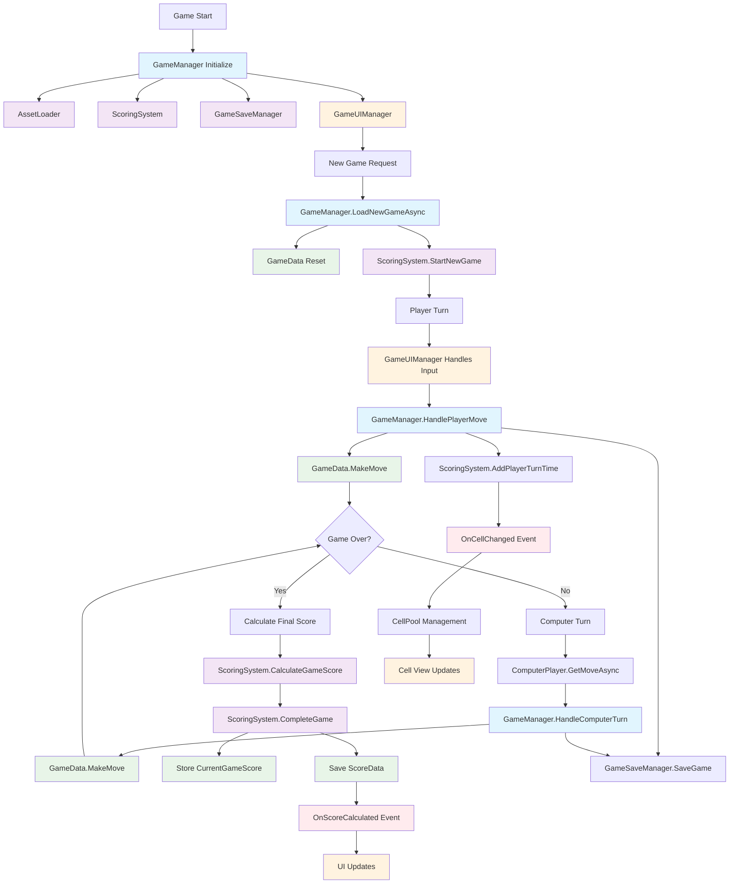
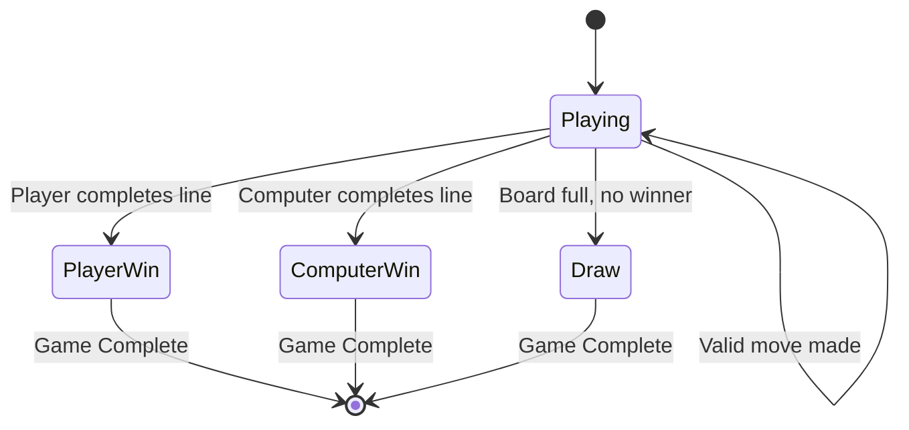

# PlayPerfect XO 

Lets just call it XO on steroids... Lack of sleep included...
Ithc: https://raspik.itch.io/perfectplay-xo

## Features 

- **Advanced Scoring System** - Time-based scoring with performance bonuses
- **Persistent Save/Load** - Automatic game state management
- **Dependency Injection** - Clean architecture using Zenject
- **Object Pooling** - Optimized cell rendering system
- **Async Operations** - Smooth gameplay using UniTask

## Architecture Overview 



## Core Components 

### GameManager
- **Central coordinator** for game flow and state management
- Handles player/computer turns and game lifecycle
- Integrates with all major systems through dependency injection
- Manages async operations for smooth gameplay

### ScoringSystem
- **Time-based scoring** with performance bonuses
- Tracks `CurrentGameScore` for the active round
- Persistent score data storage using PlayerPrefs
- Calculates final scores based on game outcome and turn efficiency

### GameData
- **Game state representation** with 3x3 board
- Cell state management (Empty, X, O)
- Move validation and win condition detection
- Serializable for save/load functionality

### ComputerPlayer
- **AI opponent** with strategic move calculation
- Async move generation for responsive gameplay
- Difficulty scaling based on game progression

### GameSaveManager
- **Automatic save/load** functionality
- JSON-based serialization
- Auto-save on each move for seamless resume

## Game States 



## Scoring System 

- **Win Score**: 1000+ points (with time bonuses)
- **Draw Score**: 500+ points (with time bonuses)
- **Loss Score**: 0 points
- **Time Bonus**: Faster moves = higher scores

## Technical Stack 

- **Unity 2022.3+**
- **Zenject** - Dependency Injection
- **UniTask** - Async/Await operations
- **TextMeshPro** - UI text rendering
- **Addressable Assets** - Resource management

## Project Structure 

```
Assets/
├── Code/
│   ├── Game/           # Core game logic
│   │   ├── Data/       # Game data structures
│   │   ├── Views/      # UI components
│   │   └── Interfaces/ # Contracts
│   ├── Services/       # External services
│   └── Installers/     # Dependency injection setup
├── Art/                # Visual assets
├── Prefabs/           # Game object prefabs
└── Scenes/            # Unity scenes
```
